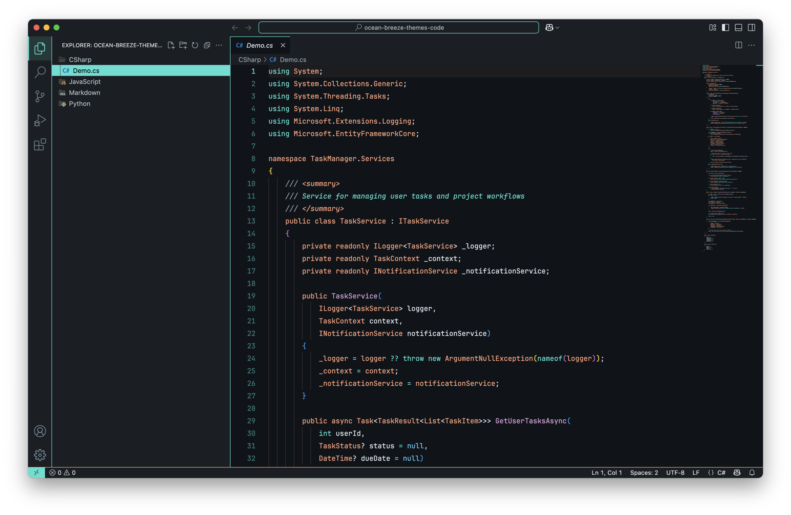
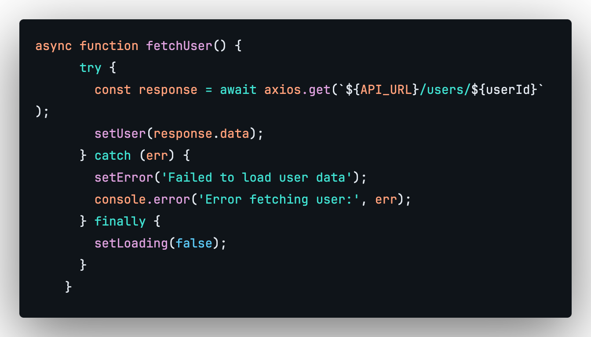
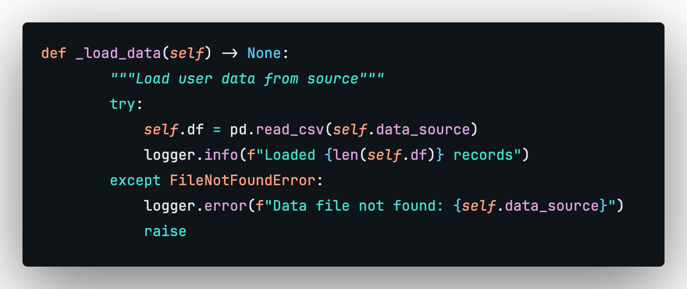
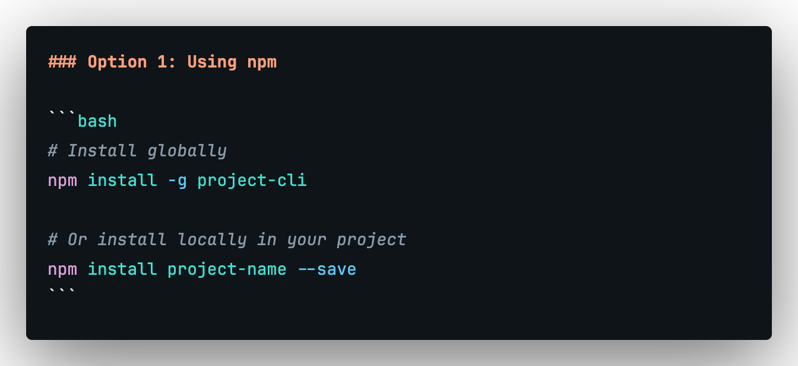

# Ocean Breeze Dark Theme

A beautiful dark theme for Visual Studio Code inspired by ocean colors. This theme features a carefully crafted color palette with teal, warm orange, and soft purple accents designed to reduce eye strain during extended coding sessions.

## Features

- 🌊 **Ocean-inspired color palette** - Calming teal, warm orange, and soft purple
- 🌙 **Eye-friendly dark design** - Optimized for low-light environments
- 🎨 **Comprehensive syntax highlighting** - Support for all major languages
- ♿ **Accessibility focused** - High contrast ratios for better readability
- 🔧 **Semantic token support** - Enhanced highlighting for modern languages
- 📱 **Consistent UI theming** - Unified experience across all VS Code panels

## Color Palette

| Color | Hex | Usage |
|-------|-----|-------|
| Teal | `#40e0d0` | Keywords, operators, links |
| Orange | `#ffa07a` | Types, classes, properties |
| Purple | `#dda0dd` | Functions, methods, decorators |
| Blue | `#5cc9f5` | Constants, numbers, attributes |
| Background | `#0f1419` | Editor background |
| Sidebar | `#1a1f23` | Side panels background |

## Installation

### Via VS Code Marketplace
1. Open VS Code
2. Go to Extensions (`Ctrl+Shift+X` / `Cmd+Shift+X`)
3. Search for "Ocean Breeze Dark Theme"
4. Click Install
5. Select the theme: `Ctrl+Shift+P` → "Preferences: Color Theme" → "Ocean Breeze Dark"

### Manual Installation
1. Download the `.vsix` file from [releases](https://github.com/creativwork/ocean-breeze-dark-theme/releases)
2. Open VS Code
3. Run `Ctrl+Shift+P` → "Extensions: Install from VSIX..."
4. Select the downloaded file

## Screenshots

### JavaScript/TypeScript

### Python

### Markdown

## Supported Languages

- JavaScript/TypeScript
- React/JSX
- Python
- Rust
- Java
- C/C++
- Go
- PHP
- HTML/CSS/SCSS
- Markdown
- JSON/YAML
- And many more!

## Contributing

Found a bug or want to suggest an improvement? Please open an issue or submit a pull request on [GitHub](https://github.com/creativwork/ocean-breeze-dark-theme).

## License

MIT License - see [LICENSE](LICENSE) for details.

## Changelog

See [CHANGELOG.md](CHANGELOG.md) for version history.

## Related Themes

- [Ocean Breeze Light Theme](https://marketplace.visualstudio.com/items?itemName=creativwork.ocean-breeze-light-theme) - The light variant of this theme

---

Made with 💙 by [Martin Matanovic](https://github.com/creativwork)